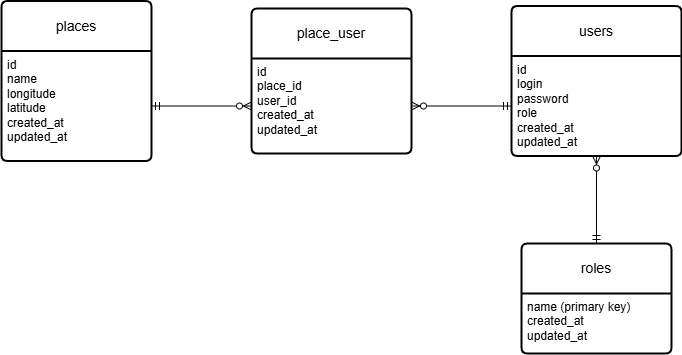

# RestAPI для приложения "Выбор места отдыха"

Приложение представляет собой RESTful API, для приложения "Выбор места отдыха"

## Содержание

1. [Установка](#установка)
2. [Схема базы данных](#схема-базы-данных)
3. [Тестирование](#тестирование)
4. [Лицензия](#лицензия)

## Установка

- git clone https://github.com/DruDruDru/travel.git (Клонируем проект)
- composer install (Устанавливаем пакеты необходимые для работы проекта)
- Создаем в корне .env и копируем содержимое .env.example в .env
- Задаём перемнные в .env
- docker-compose up -d (Запускаем скачку изображений и развертываем контейнеры)
- docker exec -it travel_app bash
- Выполняем миграции php artisan migrate --seed
- chmod 777 -R ./ (выдаем полный доступ что бы мы могли обращаться вне контейнера)
- exit (выходим их контейнера)
- php artisan jwt:secret

## Схема базы данных

## Тестирование

В корне есть файл: travel.postman_collection.json, импортируем коллекцию в Postman, запускаем запрос login, который создет JWT сохраняющейся в коллекции, далее продолжаем тестирование.

## Лицензия
MIT
